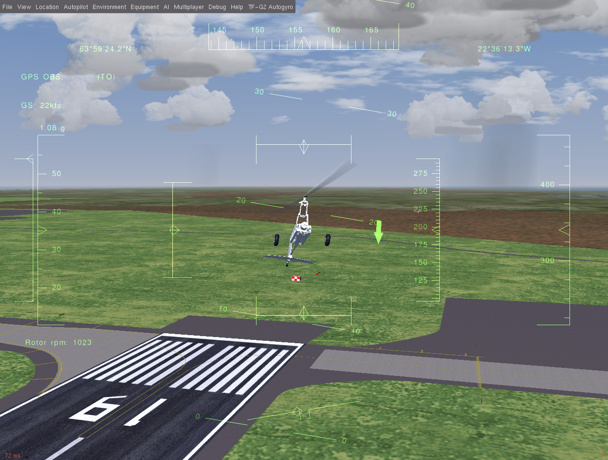
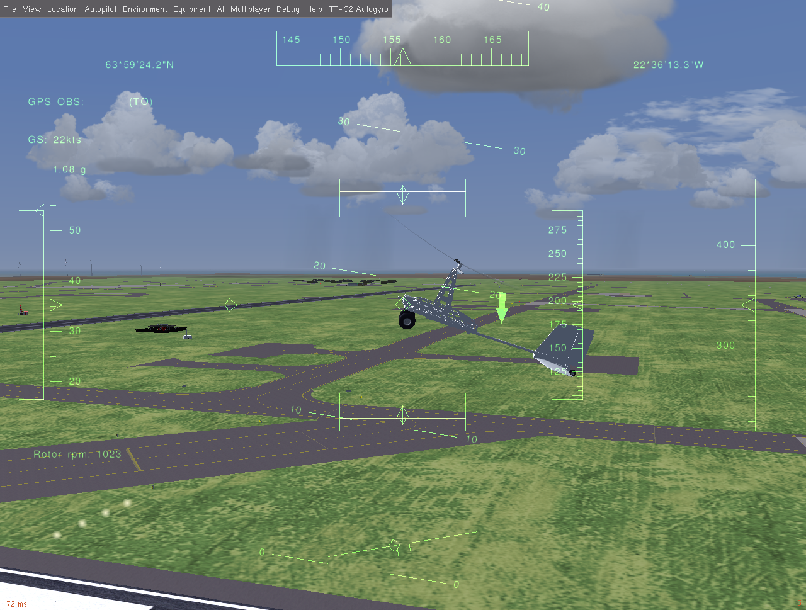

# FlightGear-TF-G2
FlightGear model of TF-G2 autogyro

## INTRODUCTION

## INSTALLATION
Extact and copy to data/Aircraft folder in FlightGear.

LINKS
http://en.wikipedia.org/wiki/Autogyro

VERSION
0.1 Alpha release
Roughly tuned flight model
-----
